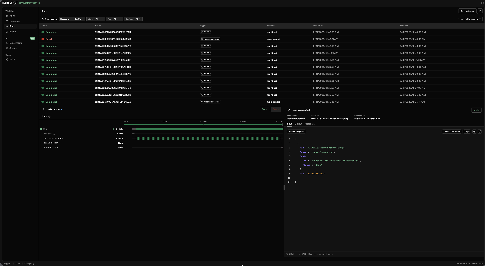

# Background Job - Report API

A small API where the slow work (an 8-second "report") runs in a background job.

The endpoint answers instantly; a status endpoint reports progress; a cron job runs on the clock alone. Built with FastAPI + Inngest.

## How to Run

Two terminals are required, and both need to stay open.

### Terminal 1 - The API

    source .venv/bin/activate

    INNGEST_DEV=1 uvicorn main:app --reload --port 8000

### Terminal 2 - The Inngest Dev Server

    npx inngest-cli@latest dev -u http://localhost:8000/api/inngest

Dashboard:

http://localhost:8288

## Endpoints & Functions

| Type | Name | Trigger | What it does |
|---|---|---|---|
| Endpoint | `GET /health` | HTTP request | Returns `{"status":"ok"}` |
| Endpoint | `POST /reports` | HTTP request | Accepts `{"topic": "..."}`, returns `202` + id instantly, and kicks off the background job |
| Endpoint | `GET /reports/{id}` | HTTP request | Returns the report's current state: `pending` → `done`/`failed`, or `404` |
| Background job | `make-report` | Event `report/requested` | Sleeps 8 seconds as a stand-in for slow work, then builds the report |
| Cron job | `heartbeat` | Schedule `* * * * *` | Every minute, logs how many reports are pending, done, and failed |

## Proof: 202 Then Poll

    $ time curl -i -X POST http://localhost:8000/reports \
      -H "Content-Type: application/json" \
      -d '{"topic":"cats"}'

    HTTP/1.1 202 Accepted
    date: Sun, 30 Aug 2026 18:12:55 GMT
    server: uvicorn
    content-length: 64
    content-type: application/json

    $ curl http://localhost:8000/reports/511608d1-0bb2-4f40-ae3d-f2a100bcf638

    {"id":"511608d1-0bb2-4f40-ae3d-f2a100bcf638","topic":"cats","status":"pending"}

    $ curl http://localhost:8000/reports/511608d1-0bb2-4f40-ae3d-f2a100bcf638

    {"id":"511608d1-0bb2-4f40-ae3d-f2a100bcf638","topic":"cats","status":"done","result":"A thorough, deeply researched report about cats."}

## Stage 3 - Why a Bad Input Gets 400, Not a Retry

A bad topic gets a 400 because the request is invalid and will fail the same way if retried. A retry is for temporary failures, such as a network or service issue, not invalid input.

## Stage 4 - Cron Expressions

- Every day at 08:00: `0 8 * * *`
- Every Sunday at 22:00: `0 22 * * 0`

## Dashboard Screenshot

The Inngest Dev Server ran successfully at `http://localhost:8288`.

The logs show a completed `make-report` execution for the `cats` report, a failed `make-report` execution for the `fail` report, and recurring scheduled heartbeat executions.

Example heartbeat log:

    INFO:     127.0.0.1:57582 - "PUT /api/inngest HTTP/1.1" 200 OK
    INFO:     Heartbeat: 0 pending, 0 done, 0 failed

